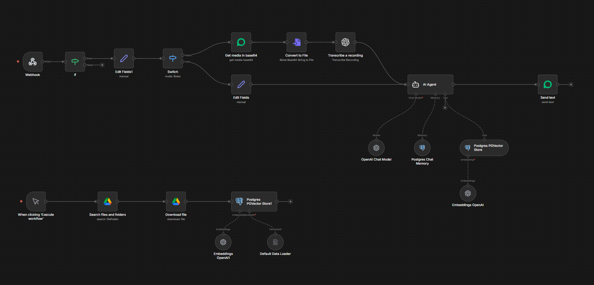

---


# 🤖 WhatsApp AI Assistant — n8n + Evolution API + RAG

> A 24/7 AI-powered WhatsApp assistant that remembers every customer — forever.
> Built for businesses that want smart, scalable, and affordable automation.

---

## ✨ Features

- 🧠 **Long-term memory** per customer — remembers conversations for years
- 🎙️ **Voice message transcription** via OpenAI Whisper
- 📁 **Knowledge base** powered by Google Drive
- 💬 **Human-like responses** with fully customizable business persona
- 💰 **Cost-efficient** — Evolution API instead of expensive WhatsApp Business API
- 🔒 **Per-customer isolation** — every client gets their own database session

---

## 🛠️ Tech Stack

| Tool | Purpose |
|------|---------|
| [n8n](https://n8n.io) | Workflow automation |
| [Evolution API](https://github.com/EvolutionAPI/evolution-api) | WhatsApp layer |
| PostgreSQL + PGVector | Long-term memory & vector search |
| OpenAI GPT-4o | Language model |
| OpenAI Whisper | Voice transcription |
| Google Drive | Knowledge base storage |

---

## 🚀 Quick Start

1. **Install n8n**
```bash
   npm install -g n8n
```

2. **Import workflow**
   - Open n8n → Import from file → select `testwp_bot_clean.json`

3. **Set credentials**
   - 🔑 OpenAI API key
   - 🔑 Evolution API key + instance name
   - 🔑 PostgreSQL connection
   - 🔑 Google Drive OAuth 

4. **Connect webhook**
   - Copy n8n webhook URL → paste into Evolution API settings

5. **Load knowledge base**
   - Add your docs to Google Drive folder
   - Run the "Execute workflow" trigger to populate vector store

---
## 📬 Contact
Built by [Ozer Emir Gurtekin](https://linkedin.com/in/ozerg)
